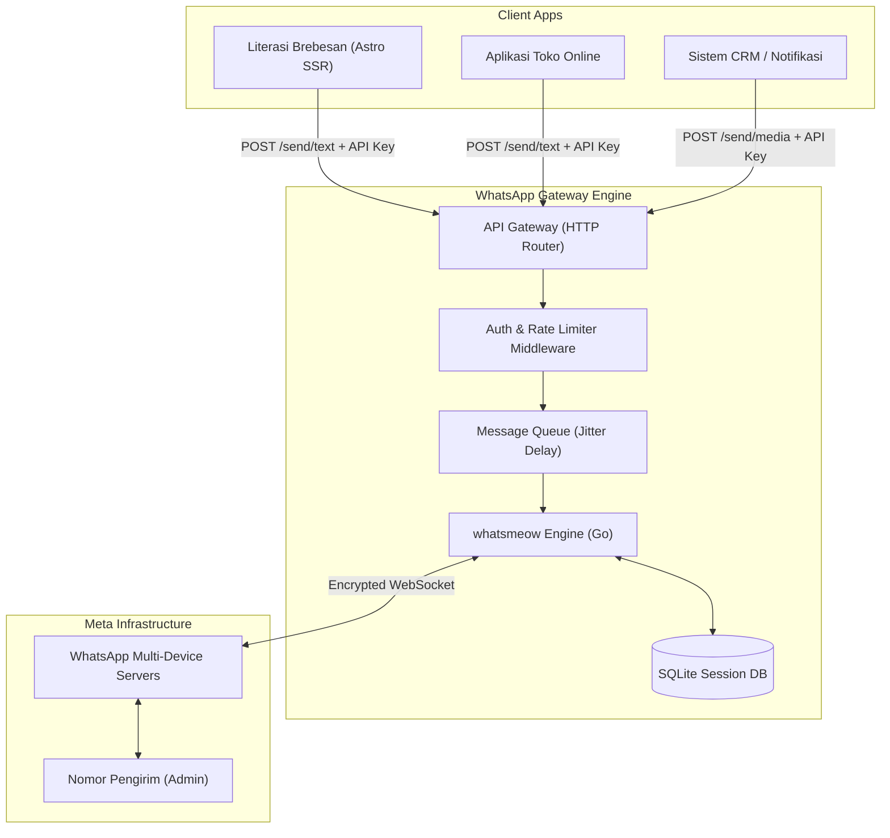

# 🚀 WhatsApp Gateway Engine (Self-Hosted & Standalone)

> **High-Performance, Low-Resource, Standalone WhatsApp REST API Gateway.**  
> Dirancang khusus untuk berjalan mandiri (*microservice*) di server pribadi (*Home Server / VPS*) tanpa ketergantungan pada pustaka pihak ketiga berbayar.

---

## 📌 Daftar Isi
1. [Latar Belakang & Filosofi Arsitektur](#-latar-belakang--filosofi-arsitektur)
2. [Fitur Utama](#-fitur-utama)
3. [Arsitektur Sistem & Topologi Jaringan](#-arsitektur-sistem--topologi-jaringan)
4. [Teknologi yang Digunakan](#-teknologi-yang-digunakan)
5. [Spesifikasi REST API](#-spesifikasi-rest-api)
6. [Mekanisme Anti-Banned & Proteksi Nomor](#-mekanisme-anti-banned--proteksi-nomor)
7. [Struktur Direktori Proyek](#-struktur-direktori-proyek)
8. [Panduan Instalasi & Menjalankan](#-panduan-instalasi--menjalankan)
9. [Blueprint Deployment (Home Server / VPS)](#-blueprint-deployment-home-server--vps)
10. [Roadmap Pengembangan](#-roadmap-pengembangan)

---

## 💡 Latar Belakang & Filosofi Arsitektur

Layanan API WhatsApp komersial (seperti Meta Cloud API atau penyedia pihak ketiga lokal) sering kali memiliki batasan:
* **Biaya Berlangganan:** Rata-rata Rp 50.000 – Rp 150.000/bulan untuk provider tidak resmi, atau Rp 450 – Rp 750/pesan untuk Meta Official.
* **Vendor Lock-In:** Terikat pada platform dan infrastruktur pihak ketiga.
* **Ketergantungan Kode Monolitik:** Menggabungkan engine bot WA langsung ke dalam web portal (misal: aplikasi komunitas, toko online, sistem kasir) adalah *anti-pattern* yang membuat beban server web berat dan rentan crash.

**WhatsApp Gateway Engine ini dirancang dengan prinsip:**
* **Standalone (Terisolasi):** Berdiri sendiri sebagai server API independen. Aplikasi klien mana pun (*Literasi Brebesan*, bot absensi, e-commerce) cukup memanggil HTTP endpoint dengan API Key.
* **Resource-Efficient:** Dioptimalkan untuk berjalan stabil di hardware berdaya rendah (seperti laptop lawas *HP ProBook*, Raspberry Pi, atau VPS 512MB RAM).
* **Multi-Client Ready:** Satu engine bot bisa melayani berbagai macam sistem sekaligus melalui perutean API Key.

---

## ✨ Fitur Utama

- 📱 **Multi-Device Support:** Menggunakan protokol WhatsApp Web Multi-Device resmi (HP pengirim tidak perlu selalu online).
- ⚡ **Ultra-Low Memory:** Konsumsi RAM sangat minim (~15 MB - 35 MB saat idle).
- 🛡️ **Anti-Ban Protection System:** Dilengkapi *In-Memory Queue*, *Rate Limiter*, dan *Jitter Delay* acak (2–5 detik) untuk meniru pola ketik manusia.
- 🔐 **API Key Security:** Akses endpoint dibatasi melalui validasi token `Authorization: Bearer <API_KEY>` atau `x-api-key`.
- 🔄 **Auto-Reconnect & Persistence:** Sesi tersimpan aman di basis data lokal (SQLite). Jika server restart atau internet terputus sementara, koneksi akan tersambung kembali otomatis tanpa perlu scan ulang.
- 🖼️ **Media Sending:** Mendukung pengiriman teks, gambar, file dokumen (PDF), dan audio.
- 📡 **Web / Terminal Pairing:** Menyediakan QR Code di terminal dan endpoint REST (`GET /api/v1/session/qr`) untuk scan via web browser.

---

## 🏗️ Arsitektur Sistem & Topologi Jaringan

### 1. Hubungan Gateway dengan Aplikasi Klien


### 2. Topologi Jaringan Home Server (Bypass CGNAT)
```mermaid
flowchart LR
    subgraph Internet Public
        User["Klien Web / Internet Publik"]
        CF["Cloudflare Edge (WAF & SSL)"]
    end

    subgraph Home / Office Network (MyRepublic CGNAT)
        CFTunnel["Cloudflare Tunnel (cloudflared)"]
        Server["HP ProBook Server"]
        WAGateway["WA Gateway Engine (:8080)"]
        Tailscale["Tailscale (Akses SSH Privat)"]
    end

    User -->|HTTPS| CF
    CF -->|Secure Encrypted Tunnel| CFTunnel
    CFTunnel --> WAGateway
    Admin["Laptop/HP Developer"] -->|WireGuard VPN| Tailscale --> Server
```

---

## 🛠️ Teknologi yang Digunakan

| Komponen | Pilihan Teknologi | Alasan Pemilihan |
| :--- | :--- | :--- |
| **Bahasa Utama** | **Golang (Go 1.22+)** | Kompilasi ke single binary, konsumsi RAM sangat irit (~25MB), konkurensi goroutine sangat tinggi. |
| **WhatsApp Library** | **`go.mau.fi/whatsmeow`** | Pustaka WhatsApp Multi-Device Go paling aktif, stabil, dan teruji di industri. |
| **Web Framework** | **Fiber** atau **Gin** | Minimal overhead, rute HTTP cepat, sintaks ringkas. |
| **Database Sesi** | **SQLite3** (ModernC / Pure-Go) | Penyimpanan sesi lokal dalam 1 file (`session.db`), tanpa perlu instalasi DBMS eksternal. |
| **Network Tunneling** | **Cloudflare Tunnels** | Membuka akses publik aman tanpa perlu IP Publik Statis atau Port Forwarding di router ISP (CGNAT). |
| **Manajemen Server** | **Systemd / PM2 & Tailscale** | Layanan berjalan otomatis saat boot; akses remote via IP pribadi aman. |

---

## 📡 Spesifikasi REST API

Semua request yang mengubah data / mengirim pesan wajib menyertakan header keamanan:
```http
Authorization: Bearer <YOUR_SECRET_API_KEY>
Content-Type: application/json
```

### 1. Cek Status Koneksi
* **Endpoint:** `GET /api/v1/health`
* **Deskripsi:** Memeriksa apakah engine menyala dan apakah nomor WA sedang terhubung (*connected*).
* **Response:**
  ```json
  {
    "status": "success",
    "data": {
      "service": "online",
      "wa_connected": true,
      "phone_number": "628123456789",
      "battery_level": 100
    }
  }
  ```

---

### 2. Dapatkan QR Code Pairing
* **Endpoint:** `GET /api/v1/session/qr`
* **Deskripsi:** Mengambil representasi QR Code saat bot membutuhkan autentikasi awal (jika belum terhubung).
* **Response:**
  ```json
  {
    "status": "success",
    "data": {
      "pairing_status": "waiting_scan",
      "qr_code_base64": "data:image/png;base64,iVBORw0KGgo...",
      "expires_in_seconds": 20
    }
  }
  ```

---

### 3. Kirim Pesan Teks
* **Endpoint:** `POST /api/v1/send/text`
* **Request Body:**
  ```json
  {
    "receiver": "6281234567890",
    "message": "Halo! Artikel Anda dengan judul *'Pesona Telur Asin Brebes'* telah berhasil diterbitkan."
  }
  ```
* **Contoh Pemanggilan via cURL:**
  ```bash
  curl -X POST https://wa.domain-anda.com/api/v1/send/text \
    -H "Authorization: Bearer RAHASIA123" \
    -H "Content-Type: application/json" \
    -d '{
      "receiver": "6281234567890",
      "message": "Pesan otomatis dari server."
    }'
  ```
* **Response (Success):**
  ```json
  {
    "status": "queued",
    "message_id": "WA-MSG-982187321",
    "receiver": "6281234567890",
    "estimated_delay_seconds": 3
  }
  ```

---

### 4. Kirim Pesan Media (Gambar / Dokumen)
* **Endpoint:** `POST /api/v1/send/media`
* **Request Body:**
  ```json
  {
    "receiver": "6281234567890",
    "media_url": "https://literasibrebesan.my.id/uploads/poster-agenda.jpg",
    "media_type": "image",
    "caption": "Pengingat: Agenda Diskusi Literasi besok sore!"
  }
  ```

---

## 🛡️ Mekanisme Anti-Banned & Proteksi Nomor

WhatsApp sangat sensitif terhadap pola pengiriman otomatis. Gateway ini menerapkan mitigasi standar industri:

1. **Jitter Delay (Jeda Acak):**  
   Pesan tidak pernah dikirim pada interval tetap (misal setiap 1.0 detik). Sistem menyisipkan jeda acak:
   $$\text{Delay} = \text{Base Delay (2 detik)} + \text{Random (0 – 3 detik)}$$
2. **Auto-Formatting Nomor Indonesia:**  
   Input seperti `0812...`, `+62812...`, atau `62812...` otomatis dinormalisasi menjadi format JID resmi: `62812xxxx@s.whatsapp.net`.
3. **Pemberian Indikator "Typing..." (Composing Presence):**  
   Sebelum pesan terkirim, engine mengirim sinyal status *Composing* selama 1–2 detik agar server WhatsApp mengidentifikasi aktivitas tersebut sebagai manusia.
4. **Batas Maksimal Pengiriman Masal (Burst Limit):**  
   Maksimal antrean dipatok 10 pesan/menit untuk kontak baru yang belum pernah berinteraksi sebelumnya.

---

## 📂 Struktur Direktori Proyek

```text
whatsapp-gateway/
├── cmd/
│   └── server/
│       └── main.go           # Entrypoint aplikasi server
├── internal/
│   ├── api/
│   │   ├── handler.go        # HTTP Handlers (Send, Health, QR)
│   │   └── middleware.go     # API Key & Rate Limit check
│   ├── config/
│   │   └── config.go         # Parsing environment variables
│   ├── queue/
│   │   └── dispatcher.go     # In-memory message queue & jitter delay
│   └── whatsapp/
│       ├── client.go         # Inisialisasi whatsmeow client
│       ├── event.go          # Event handler (Disconnect, Message received)
│       └── session.go        # SQLite session container
├── store/
│   └── session.db            # Database sesi lokal (Auto-generated)
├── .env.example
├── .gitignore
├── Makefile
├── go.mod
├── go.sum
└── README.md
```

---

## 🚀 Panduan Instalasi & Menjalankan

### 1. Kebutuhan Sistem (Prerequisites)
* Go versi `1.22+` terpasang di sistem (`go version`).
* GCC / SQLite compiler bawaan sistem.

### 2. Kloning & Pengaturan Konfigurasi
```bash
# Masuk ke direktori proyek
cd /root/whatsapp-gateway

# Salin konfigurasi environment
cp .env.example .env

# Edit file .env sesuai kebutuhan
nano .env
```

Contoh konfigurasi `.env`:
```ini
APP_NAME=WAGateway
APP_PORT=8080
API_SECRET_KEY=kunci_rahasia_anda_yang_sangat_panjang_123

# WhatsApp Session Config
SESSION_DB_PATH=./store/session.db
LOG_LEVEL=INFO

# Anti-ban Queue settings
MIN_DELAY_SECONDS=2
MAX_DELAY_SECONDS=5
```

### 3. Jalankan Mode Development
```bash
# Download dependencies
go mod tidy

# Jalankan server
go run cmd/server/main.go
```
*Saat pertama kali dijalankan, QR Code akan tercetak di terminal. Buka aplikasi WhatsApp di HP Anda -> **Perangkat Tertaut (Linked Devices)** -> **Tautkan Perangkat** -> Scan QR tersebut.*

### 4. Build Binary Produksi
```bash
# Build binary tunggal
go build -ldflags="-s -w" -o bin/wa-gateway cmd/server/main.go

# Jalankan file binary
./bin/wa-gateway
```

---

## 🖥️ Blueprint Deployment (Home Server / VPS)

Untuk memastikan gateway hidup 24/7 di laptop server (misal: *HP ProBook 6450b*) tanpa mati ketika terminal ditutup:

### 1. Pasang Sebagai Layanan Systemd (Linux)
Buat file `/etc/systemd/system/wa-gateway.service`:
```ini
[Unit]
Description=WhatsApp Gateway Engine
After=network.target

[Service]
Type=simple
User=root
WorkingDirectory=/root/whatsapp-gateway
ExecStart=/root/whatsapp-gateway/bin/wa-gateway
Restart=always
RestartSec=5
EnvironmentFile=/root/whatsapp-gateway/.env

[Install]
WantedBy=multi-user.target
```

Aktifkan dan jalankan:
```bash
sudo systemctl daemon-reload
sudo systemctl enable wa-gateway
sudo systemctl start wa-gateway
sudo systemctl status wa-gateway
```

### 2. Publikasi Aman via Cloudflare Tunnel
Agar server lokal bisa diakses oleh aplikasi web publik tanpa IP publik statis:
```bash
# Install cloudflared
curl -L --output cloudflared.deb https://github.com/cloudflare/cloudflared/releases/latest/download/cloudflared-linux-amd64.deb
sudo dpkg -i cloudflared.deb

# Hubungkan tunnel ke port lokal gateway
cloudflared tunnel run --url http://localhost:8080 nama-tunnel-anda
```

---

## 🗺️ Roadmap Pengembangan

- [x] Perancangan arsitektur sistem & spesifikasi API
- [ ] Inisialisasi Go module & dependensi `whatsmeow`
- [ ] Implementasi WhatsApp client & QR scanner di terminal
- [ ] Implementasi HTTP Router (Fiber/Gin) & middleware API Key
- [ ] Integrasi In-Memory Message Dispatcher (Jitter Delay)
- [ ] Endpoint pengiriman gambar & dokumen
- [ ] Webhook inbound (Meneruskan pesan balasan user ke sistem web klien)
- [ ] Web Dashboard sederhana untuk monitoring status kuota & baterai HP

---

## 📄 Lisensi
Didistribusikan di bawah lisensi pribadi / tertutup untuk ekosistem aplikasi independen pengembang.
